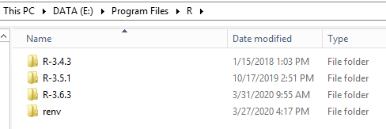

# R on Server Info

R is available on the server for all Remote Desktop users. 

### Contents

- [Getting Started](#getting-started)
- [Usage](#usage)
- [Installation Customization](#installation-customization)
- [Reinstalling R](#reinstalling-r)
- [Updating R](#updating-r)

## Getting started

Include some info on how to open R for the first time and what you should see. Also reference [Rstudio Recommended Settings](rstudio-settings.md). 

## Usage

Probably give a little background on renv here, and the cache location. Also discuss package installation (either into an renv project library or into your user-specific library).

## Installation Customization

R is installed on the E:/ drive instead of the default C:/ drive:



### Startup

Two files that define the customized system-level R startup are located in a subfolder of the R installation (`./R-3-6.3/etc/`). You can learn more about R startup settings by running `?Startup` from the console.

#### Rprofile.site

```r
# Defines some Southwick server setup

local({

# Set option - installation: binary
# This might help alleviate the occasional versioning issues with R on Windows
options(pkgType = "binary")

# Ensure a user path exists in .libPaths()
# - to prevent accidental installations into base R library
r_version <- paste(R.Version()$major, R.Version()$minor, sep = ".")
user_library_path <- file.path(Sys.getenv('R_USER'), 'R', 'win-library', r_version)

if (!dir.exists(user_library_path)) {
    dir.create(user_library_path, recursive = TRUE)
    .libPaths(user_library_path) # ensures availability on first use
}

# Print startup R message
cat(paste0(
    'Southwick R Setup\n-----------------\n',
    'A small amount of customization is included for the server R installation.\n',
    'R is installed in ', Sys.getenv('R_HOME'), '/',
    ' and includes 2 custom startup files:\n',
    '- ./etc/Rprofile.site\n',
    '- ./etc/Renviron.site\n\n'
))

})     
```

#### Renviron.site

```r
# Southwick Environmental Variables

# Version-specific user library
R_LIBS_USER ='${R_USER}/R/win-library/3.6.3'

# For package renv
# - location of global library cache
RENV_PATHS_ROOT = 'E:/Program Files/R/renv'

# - location of locally-stored packages (i.e., those not on github)
RENV_PATHS_LOCAL = 'E:/SA/Projects/R-Software/Southwick-packages/_builds_binary'

# For using the US Census API
CENSUS_API_KEY = '7ce74869fb8e921c9aacef808dc7c2180c1e1d73'
```

## Reinstalling R

Probably include some info here in case R needs to be reinstalled (and what to do when updating).

## Updating R

