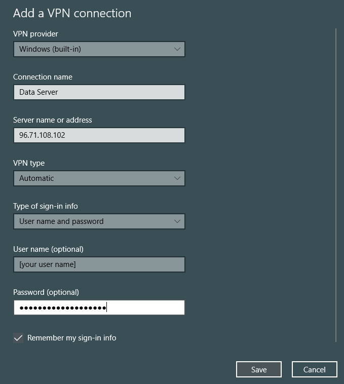

# Data Server Setup & Rules

Southwick Associates maintains a high-performance server in its office that can be accessed remotely (using a VPN) for license data processing. It supports up to 5 concurrent remote desktop users, and is intended for intensive workloads that use sensitive data.

Data used in processing dashboards is highly sensitive, and state license data **must never** be transferred to another machine (i.e., it can only live on the data server).

### Contents

- [Usage Rules](#usage-rules)
- [Windows VPN/RD Setup](#windows-setup)
- [Mac VPN/RD Setup](#mac-setup)

## Usage Rules

These rules must always be followed:

- Never transfer license data to another location.
- Lock your personal computer (or terminate the Southwick VPN) when you are away from your machine.
- Don't install software without permission of the project manager.

You should also be cognizant of how much of the shared resources you are using (particularly RAM):

- When working with large datasets in R, use a SQLite interface to limit data queries to the rows/columns that you need (i.e., avoid pulling complete datasets into R if possible).
- Close resource-heavy applications when not in use.
- Log off from the Server at the end of your work day (From your Remote Desktop: Start >> log off) .

## VPN & Remote Desktop Setup

Windows and Mac have different setup requirements.

### Windows Setup

Access to the server is provided for specific analysts using a VPN connection in conjunction with Windows Remote Desktop. User account credentials will be provided to each analyst by the project manager (see below for connection instructions).

#### VPN

The server can only be accessed using a Southwick VPN (Virtual Private Network), which provides a secure channel between your personal computer and the server. Microsoft Windows has a built-in VPN connection utility. Before making a Remote Desktop connection, users must establish a VPN connection. In Windows 10:

Network Status >> VPN >> Add a VPN connection

Then click on the new VPN icon and connect. You can verify the VPN connection by clicking on the network icon in the task tray. The list of network options should show the VPN as connected. 

#### Remote Desktop

Microsoft Windows has a built-in Remote Desktop (RD) application that can be used for connecting to the server. Once connected to the VPN, you can connect to Remote Desktop by clicking on the Windows start menu and typing "Remote Desktop Connection" >> Show Options and then enter your credentials:

When the RD window is active, the user's keyboard and mouse function as though they are connected directly to the server. Our RD license allows up to five concurrent connections to the server. This means that more than one (and up to five) people can be connected to the server at the same time without interfering with each other (although they must share the server's computing resources).

### Mac Setup

For Mark to add.

#### VPN

#### Remote Desktop
